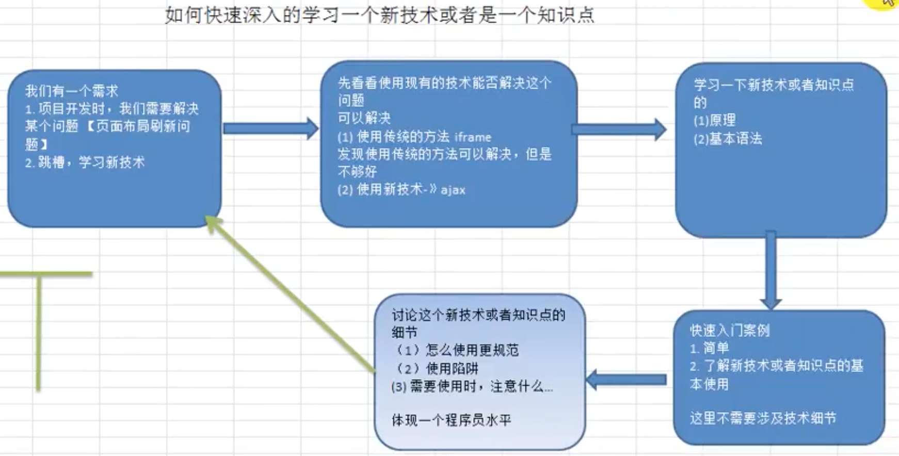
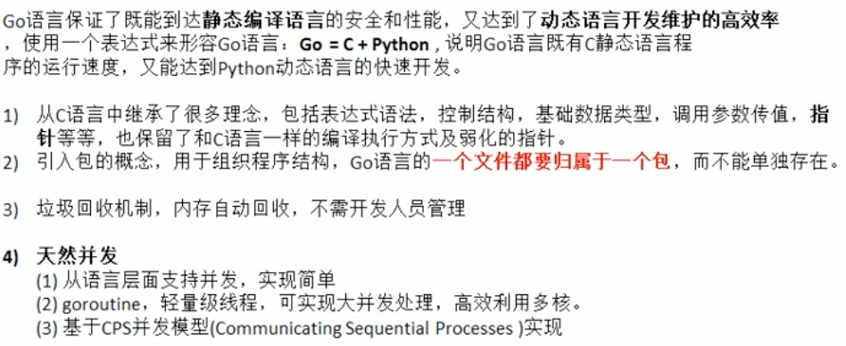
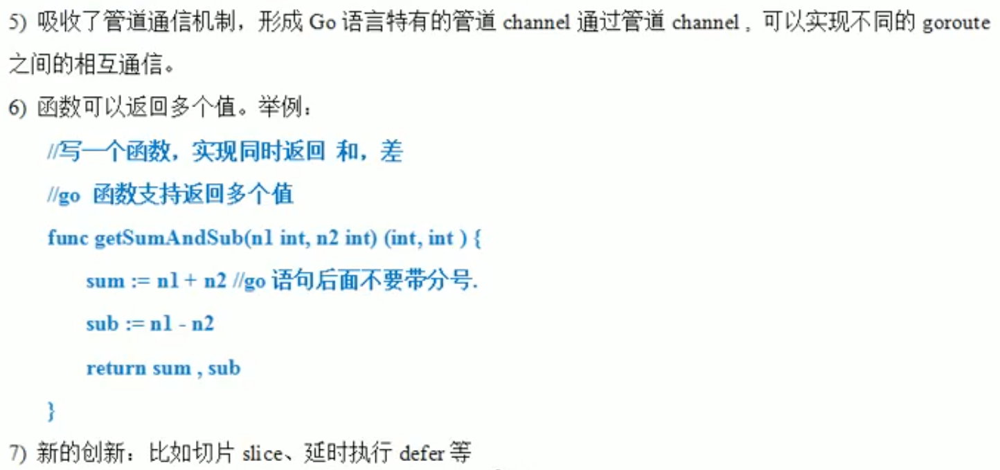
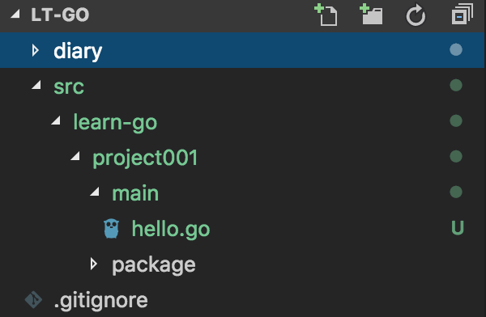
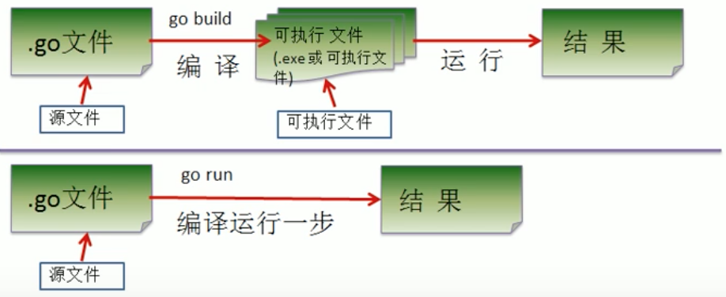
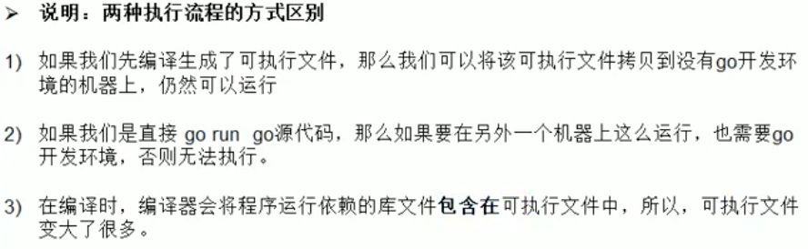

# Learning Golang

<2018.08.22>
## 关于学习方法

1. 高效
2. 先整体框架，后细节
3. 先how后why，做了才会
4. 琢磨别人怎么做



## 了解Golang

### Go的趋势

1. Google创造：多核多CPU；简洁高效；风格统一；高并发；C++编译慢，内存泄漏。兼顾编译语言的运行速度和脚本语言的开发速度。
2. 区块链主流语言
3. 国内外云计算转型语言

### Golang发展史

1. Ken Thompson：Unix、C语言发明者之一，图灵奖。
2. Rob Pike
3. Robert

2009年发布第一版，2015年v1.5“移除最后的C代码”

### Golang的特点




## 开发工具

1. 前期使用vscode学习Golang基础，在本地运行
2. 后期在Linux上跑

## 安装Golang

1. 下载`go1.10.3.darwin-amd64.tar.gz`
2. 解压为`~/app/go`
3. 环境变量，编辑`vim ~/.config/omf/init.fish`，添加`GOROOT`、`GPPATH`和`PATH`

## Hello Golang

### 程序目录结构



1. 文件后缀： `.go`
2. `packange main`:
   `hello.go`所属包是`main`。在Golang中每个文件必须属于一个包。
3. `import "fmt"`:引入包，使用包中的函数
4. `func main() {}`：main函数，程序入口
   
### 编译和运行

```shell
go build hello.go
./hello
```
or 
```
go run hello.go
```

编译和运行说明:
- `go build`可以指定生成的可执行文件的名称：
```shell
go build -o <bin_name> hello.go
```

**实际上`go run`也是先编译后执行**
   
<2018.08.23>
## Golang执行流程

两种方式：



两种方式的区别：


