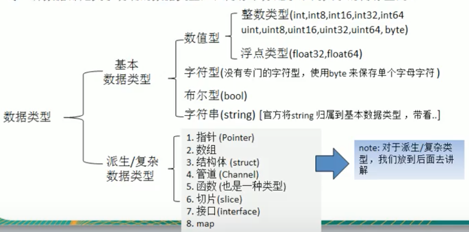

# Learning Golang

<2018.08.22>
## 关于学习方法

1. 高效
2. 先整体框架，后细节
3. 先how后why，做了才会
4. 琢磨别人怎么做


## 了解Golang

### Go的趋势

1. Google创造：多核多CPU；简洁高效；风格统一；高并发；C++编译慢，内存泄漏。兼顾编译语言的运行速度和脚本语言的开发速度。
2. 区块链主流语言
3. 国内外云计算转型语言

### Golang发展史

1. Ken Thompson：Unix、C语言发明者之一，图灵奖。
2. Rob Pike
3. Robert

2009年发布第一版，2015年v1.5“移除最后的C代码”

### Golang的特点


## 开发工具

1. 前期使用vscode学习Golang基础，在本地运行
2. 后期在Linux上跑

## 安装Golang

1. 下载`go1.10.3.darwin-amd64.tar.gz`
2. 解压为`~/app/go`
3. 环境变量，编辑`vim ~/.config/omf/init.fish`，添加`GOROOT`、`GPPATH`和`PATH`

## Hello Golang

### 程序目录结构


1. 文件后缀： `.go`
2. `packange main`:
   `hello.go`所属包是`main`。在Golang中每个文件必须属于一个包。
3. `import "fmt"`:引入包，使用包中的函数
4. `func main() {}`：main函数，程序入口
   
### 编译和运行

```shell
go build hello.go
./hello
```
or 
```
go run hello.go
```

编译和运行说明:
- `go build`可以指定生成的可执行文件的名称：
```shell
go build -o <bin_name> hello.go
```

**实际上`go run`也是先编译后执行**
   
<2018.08.23>
## Golang执行流程

两种方式：


两种方式的区别：


<2018.08.24>
## Go程序开发注意事项

- 文件扩展名：`.go`
- 程序入口：`main()`函数
- 大小写敏感
- 每行一条语句，每个语句后**不需要分号**
- <font color=red>定义变量或import包，但是unused，不能编译通过</font>

## Golang转义字符

1. `\t`: tab
2. `\n`: newline
3. `\\`: \
4. `\"`: "
5. `\r`: return

## Comment in Golang

### inline comment
```go
// inline comments
```

### block comment (multi-lines)
```go
/*
    multi-line comments
    second line
*/
```

## Golang Code Style

1. 尽量使用行注释
2. `gofmt -w <go_file>`: 格式化代码
3. 运算符两边加空格
4. 函数的左花括号跟函数名在同一行：
```go
func main() {
    ...
}
```
思想：<font color=red>一个问题尽量只有一种解决方法</font> 

5. 一行80个字符以内

## Golang official website

[Golang官网](https://golang.org/)

<2018.08.25>
## 变量

1. 三种声明方式(demo01)
2. 一次声明多个变量(demo02)
3. 全局变量(demo03)
4. 变量使用注意事项(demo04)
5. 默认值：int:0, string:"", float:0

## 数据类型



### 整数类型(demo06)

1. `int, int8, int16, int32, int64, uint, uint8, uint16, uint32, uint64`
2. 查看数据类型，字节大小
    - fmt.Printf("%T", n)
    - unsafe.Sizeof()

### 浮点类型(demo07)

1. 默认是float64

### 字符类型(demo08)

1. Golang中没有专门的字符类型
2. Golang中的字符串由字节组成，而不是由字符组成的
3. fmt.Printf("%c", c)
4. Golang use `utf-8`, 兼容ASCII

<2018.08.26>
### bool类型(demo09)

1. 赋值的时候只能赋ture或false
2. 占1个字节

### string字符串类型(demo10)

1. Golang的字符串由**单个字节**连接而成
2. 使用utf-8编码
3. Golang中的字符串一旦赋值就**不可变**了
4. 双引号转义，**反引号**不转义
5. 字符串拼接：`+`
6. 多行拼接，`+`要放在行末

### 基本数据类型的默认值(demo11)

默认值是**零值**

### 基本数据类型的转换(demo12)

1. 必须**显式转换**，不能自动转换: T(v)
2. **范围小->范围大**或**范围大->范围小**都可以，但是由大到小可能会导致**溢出**
3. string与其他基本数据类型的转换
    - fmt.Sprintf()
    - strconv

