# imooc learn go diary

<2018.09.11>
## 变量定义

### 使用var关键字

- `var a, b, c bool`
- `var s1, s2 string = "hello", "world"`
- 可放在函数内，或直接放在**包内**（看上去像全局变量，但不是全局变量）
- 使用`var()`集中定义变量

### 让编译器自动决定类型

- `var a, b, i, s1, s2 = true, false, 3, "hello", "world"`

### 使用`:=`定义变量

- `a, b, i, s1, s2 := true, false, 3, "hello", "world"`
- 只能在函数内使用

## 内建变量类型

- bool, string
- (u)int, (u)int8, (u)int16, (u)int32, (u)int64, uintptr
- byte, rune
- float32, float64, complex64, complex128

### 强制类型转换

- 类型转换是强制的（没有隐式转换）
- `var a, b int = 3, 4`
- `var c int = math.Sqrt(a*a + b*b)`    **wrong**
- `var c int = int(math.Sqrt(float64(a*a + b*b)))`  **right**

### 变量定义要点

- 变量类型写在变量名之后
- 编译器可推测变量类型
- 没有`char`，只有`rune`
- 原生支持复数类型

## 常量的定义

- `const filename = "abc.txt"`
- `const`数值可以作为各种类型使用
- `const a, b = 3, 4`
- `var c int = int(math.Sqrt(a*a + b*b))`，**a和b不用再进行强制类型转换为float**

### 特殊的常量-枚举类型

- 普通枚举类型
- 自增值枚举类型（使用`iota`）

## 条件语句

### if

- `if`的条件里不需要括号
- `if`的条件里可以赋值，但是作用于在`if`语句内

### switch

- `switch`会自动`break`，除非使用**fallthrough**
- `switch`后可以不跟表达式

<2018.09.12>
### `for`

- `for`的条件里不要括号
- `for`的条件里可以省略初始条件，结束条件，递增表达式
- go语言中没有`while`

### 基本语法要点回顾

- `for`和`if`的条件没有括号
- `if`条件里也可以定义变量
- 没有`while`
- `switch`不需要`break`，也可以直接`switch`多个条件

<2018.09.13>
## 函数

- `func eval(a, b int, op string) int`
- 可以返回多个值，返回的多个值可以命名
- 函数可以做参数
- 可变参数列表：`...`
- 没有默认参数

## 指针

- **go语言的指针不能运算**

### 参数传递

值传递？还是引用传递？
- go语言只有值传递一种方式

## 数组

- 数量写在类型前面
- 数组的遍历：`for i, v := range arr`
- 数组是**值类型**，参数传递时会拷贝数组
- go语言中一般不直接使用数组，而是切片

## Slice(切片)

```go
arr := [...]int{0, 1, 2, 3, 4, 5, 6, 7}
s := arr[2:6]

s[0] = 10
```

- arr变为: [0 1 10 3 4 5 6 7]

- Slice本身没有数据，是对底层array的一个**view**

### Reslice

slice的slice

### Slice的扩展

```go
arr := [...]int{0, 1, 2, 3, 4, 5, 6, 7}
s1 := arr[2:6]
s2 := s1[3:5]
```

- s2: [5 6]

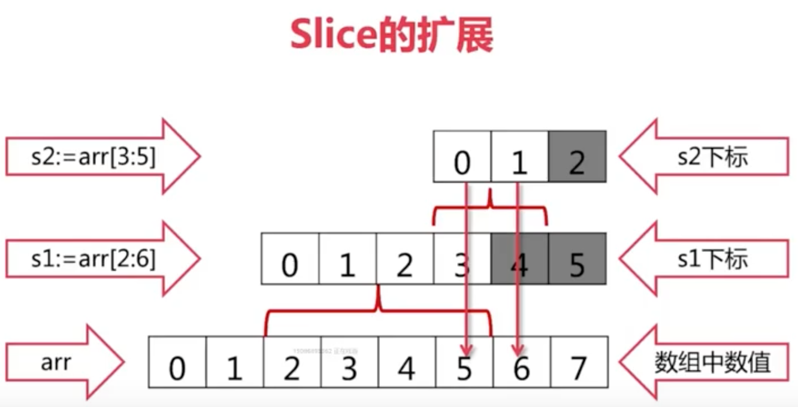
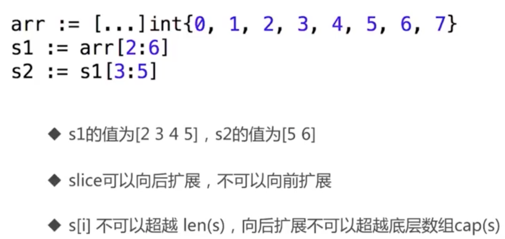


### Slice的实现

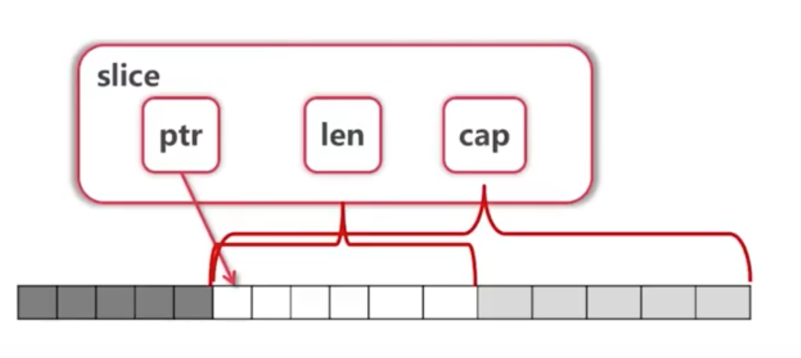

### 向Slice添加元素

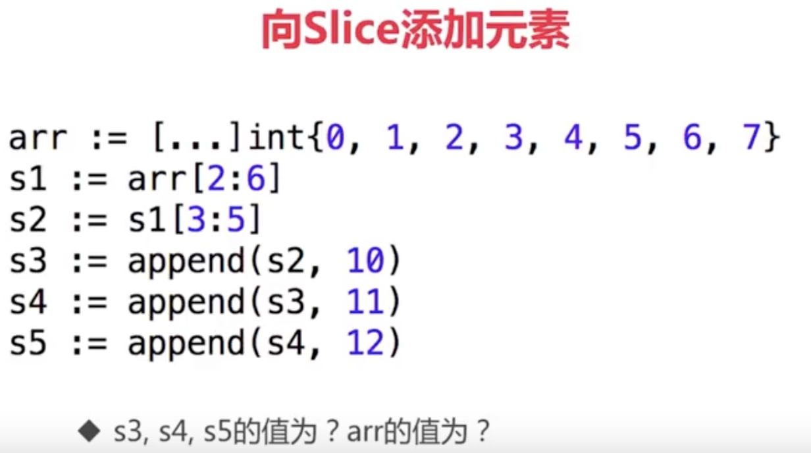

<2018.09.14>
## Map

### Map的操作

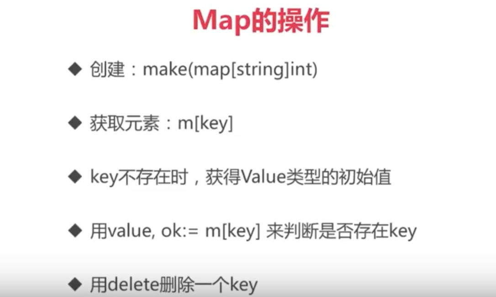

### Map的遍历


### Map的key

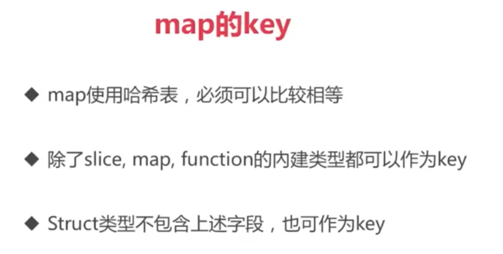

### 练习

leetcode: [3. Longest Substring Without Repeating Characters](https://leetcode.com/problems/longest-substring-without-repeating-characters/description/)

## 字符和字符串

- `rune`相当于go的`char`


- 字符串的操作在`strings`包

## 面向对象

- go语言仅支持封装，不支持继承和多态
- go语言没有`class`，只有`struct`
- 不论是地址（指针）还是结构本身，一律使用`.`来访问成员

### 结构体的创建

- 使用自定义工厂函数
- 可以返回局部变量的地址

### 为结构体定义方法

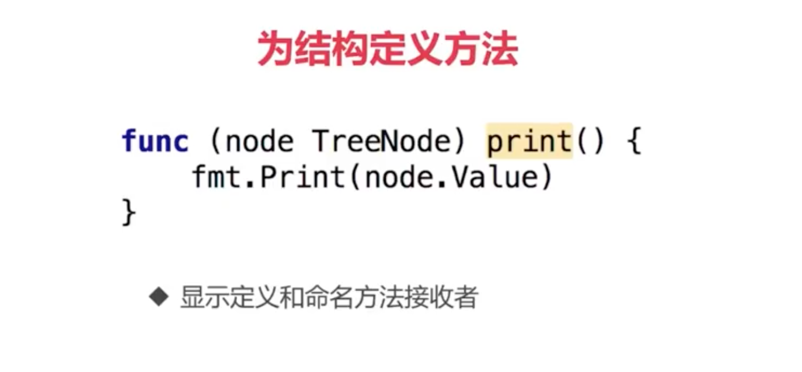

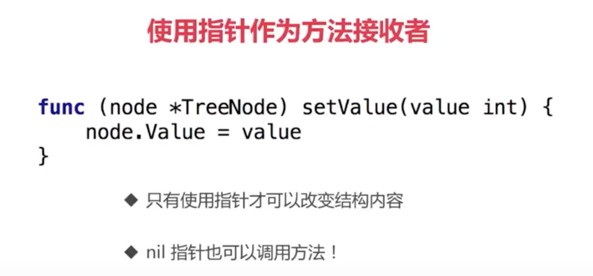

### 值接收者 vs 指针接收者

- 要改变内容-->指针接收者
- 结构过大-->指针接收者
- 一致性：如有指针接收者，最好都是指针接收者
- **值接收者**是go语言特有的
- 值/指针接收者均可接受值/指针

### 封装

- 名字一般使用[CamelCase](https://en.wikipedia.org/wiki/Camel_case)
- 首字母大写：`public` 
- 首字母小写：`private` 

### 包

- 每个目录一个包
- main包包含可执行入口
- 为结构体定义的方法必须在同一个包内
- 可以是不同的文件

#### 如何扩充系统类型或别人的类型

1. 定义别名
2. 使用组合


## **GOPATH**环境变量

change my GOPATH from ~/github/lt-go to ~/go

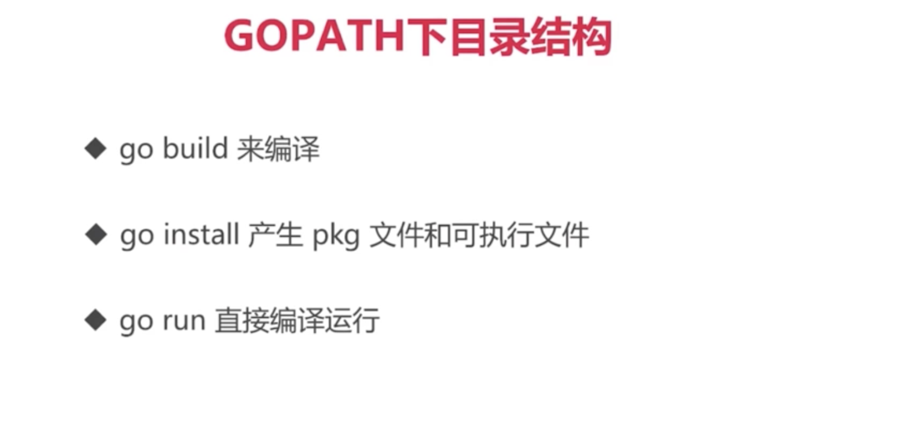

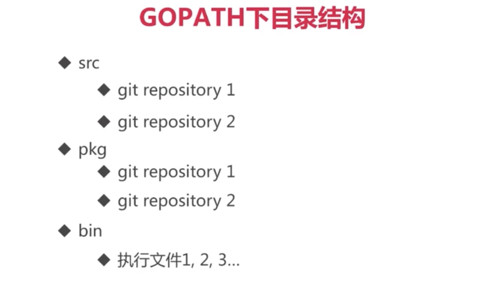

## 接口

- [duck typing](https://en.wikipedia.org/wiki/Duck_typing)

### 接口的定义

- 接口由**使用者**定义
- 接口的实现是隐式的，只要实现接口的方法

### 接口的值类型

- 表示任何类型：`interface{}`
- Type Assertion
- Type Switch


<2018.09.15>
### 接口的组合

for example:
```go
type ReadWriter interface {
    Reader
    Writer
}
```

### 常用系统接口

- `Stringer`
- `Reader/Writer`

## 函数与闭包

### 函数式编程 vs 函数指针

- 函数是一等公民：参数、变量、返回值都可以是函数
- 高阶函数
- 函数-->闭包

### “正统”函数式编程

- 不可变性：不能有状态，只有常量和函数
- 函数只能有一个参数
- 本课程不作上述严格规定

### go语言的闭包

- 比较自然，不需要修饰如何访问自由变量
- 没有Lambda表达式，但是有匿名函数

## 资源管理与出错处理

### defer调用

- 确保调用在函数结束时发生
- 参数在defer语句时计算
- defer列表为**先进后出**
- 使用场景：
    - Open/Close
    - Lock/Unlock
    - PrintHeader/PrintFooter

### 错误处理

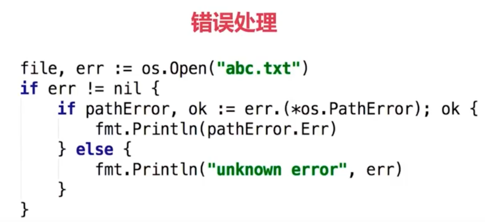

